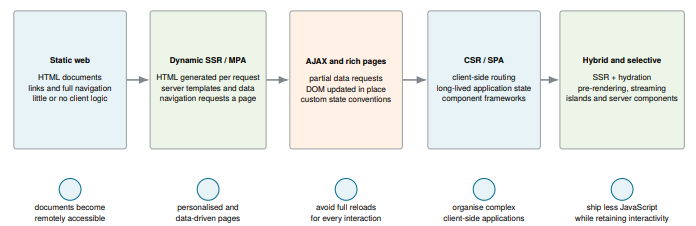
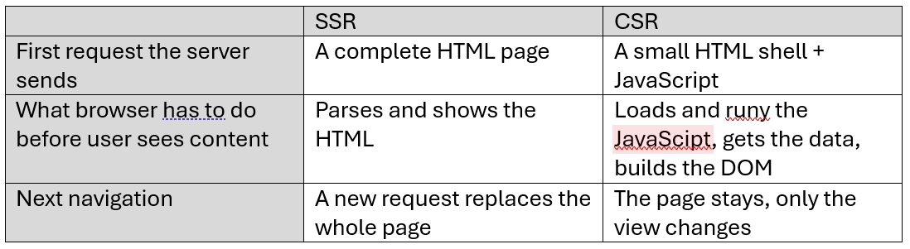
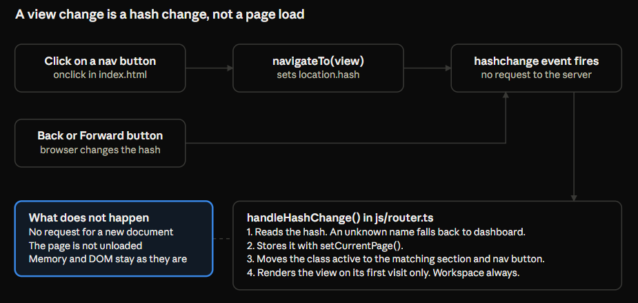
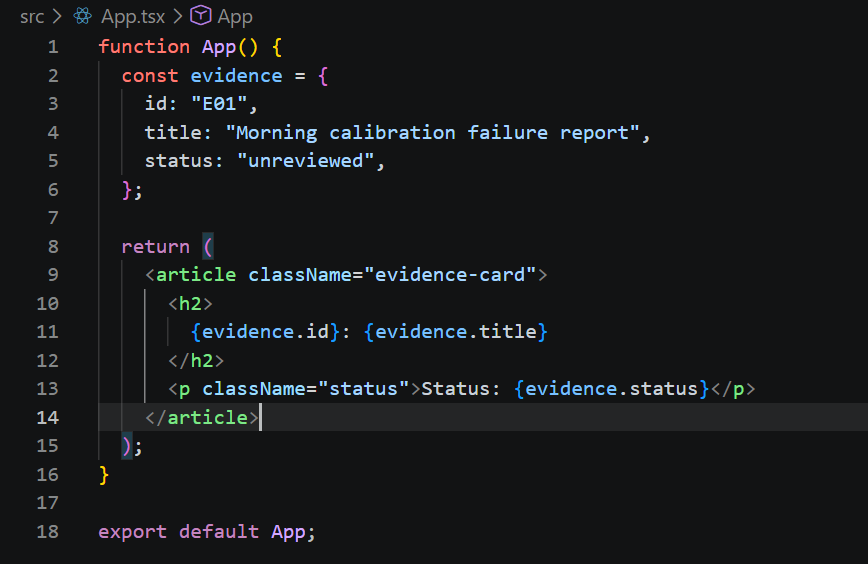
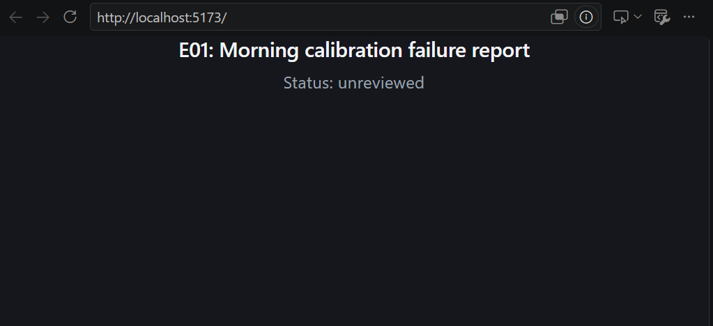

# Exercise 3 — React Foundations & First Migration

This is the third exercise in Advanced Web Engineering Course (CSDC). It builds on Exercises 1 and 2. This exercise adds
React to that project and migrates the **application shell and one representative view (the Dashboard)** to it. The rest of the app stays vanilla TS for now. You'll migrate more of it in Exercises 4 and 5.

Keep a running note of what you changed and why, and commit as you go. Several theory questions ask you to point at a specific decision or diff you made.

## Corresponding manuscript reading

This exercise corresponds to the following chapters in the course manuscript:

- **Chapter 12, From Static Documents to Rich Web Applications** — PDF pp. 85–88
- **Chapter 13, Rendering and Navigation Architectures** — PDF pp. 90–95
- **Chapter 14, Hybrid Rendering and Modern Web Architectures** — PDF pp. 96–100
- **Chapter 15, React Foundations** — PDF pp. 102–109

## Self-Check

The exercise is organized into 10 individual tasks with corresponding questions, that are
presented in class.

These checkboxes are for self-checking. Don't forget to do the actual checking of tasks you are able to present in the Moodle course. **Before class, tick only what you can genuinely demonstrate or answer on the spot, live.**

| #   | Demo                                               | Ready? |
| --- | -------------------------------------------------- | ------ |
| 1   | Historical view of the web                         | ☐      |
| 2   | SSR vs. CSR                                        | ☐      |
| 3   | The virtual DOM                                    | ☐      |
| 4   | SPA vs. MPA: state & routing                       | ☐      |
| 5   | React introduction                                 | ☐      |
| 6   | React + TypeScript entry point in the Vite project | ☐      |
| 7   | Component hierarchy for the whole app              | ☐      |
| 8   | Architecture Decision Record: why SPA/React        | ☐      |
| 9   | Migrate the application shell                      | ☐      |
| 10  | Migrate the Dashboard view                         | ☐      |

A demo only counts as "Ready" once **every** task and question checkbox inside it (below) is
ticked — the table above is just a fast overview, tick the boxes inside each demo first.

---

## Demo 1 — Historical view of the web

**Tasks**

- [ ] Give a concise explanation of how web applications evolved over the years and place the app from the exercises on the timeline. Justify where you put it.

  **Answer:**

  no stage replaces an earlier stage, each stage fixed a limitation on the one before.

  

  - Static Web: HTML files connected with links. Every click loads another page.
  - Dynamic SSR/MPA: The server builds the HTML on request from a template and data. Every navigation still loads a new page/full document reload.
  - AJAX: JavaScript gets data in the background and updates only one part of the page.
  - CSR/SPA: The browser gets a shell plus JavaScript and builds the page itself. One page stays and shows all the views.
  - Hybrid: The server renders the first view, then the browser takes over.

  App sits on step 4 - CSR / SPA
  - CSR: the server only sends a shell, and the browser builds the content from JSON data.
  - SPA: switching views doesn't load a new page.

**Questions** (depend on the tasks above)

- [ ] What specific problem was AJAX (and libraries like jQuery) solving that plain server-rendered pages couldn't? What new problems did that approach introduce, that SPA frameworks then tried to solve?

  **Problem AJAX solved:** every interaction meant a full document request. The browser threw away the current page and loaded a new one. AJAX let JavaScript get the data in the background and updates just one part of the page.
  Back then, browsers implemented the same things differently, so you had to write different code for each browser.jQuery made it easier by hiding those differences.

  **new problems:** The new problem was state. More and more data lived in the browser and was changed in many different places, so it got hard to know which data is correct and which parts of the page need an update."

- [ ] This app currently uses hash-based routing (`#dashboard`, `#evidence`, ...) with no full page reload between views. Which era does that pattern belong to, and what does it tell you about when this architectural choice became common?

  It belongs to step four, the SPA era, because the views change without loading a new page. It became common when AJAX pages turned into real applications that stay open and keep their state in the browser. They needed a URL for every view, but without a reload, and the hash does exactly that.

---

## Demo 2 — SSR vs. CSR

**Tasks**

- [ ] Present a short comparison table for Server-Side Rendering and Client-Side Rendering. Explain what the server sends on first request, what the browser has to do before the user sees content, and what happens on subsequent navigation.

  

  **SSR:** the server sends a complete HTML page. The browser just parses it and shows it, and every navigation loads a new page.

  **CSR:** the server only sends a small shell plus JavaScript. The browser has to load and run the JavaScript, get the data and build the DOM itself. And when you navigate, the page stays and only the view changes.

- [ ] Pick one real, publicly known website and argue whether it's (primarily) SSR or CSR, using
      observable evidence (view source, network tab, etc.).

  wikipedia article: https://en.wikipedia.org/wiki/Single-page_application#Page_lifecycle

  SSR because the article text is already in the HTML that the server sent. And when I click a link, a new document is requested and the page is replaced.

**Questions** (depend on the tasks above)

- [ ] Explain why this exercise application is SSR or CSR and why. Walk through, step by step, what happens between the browser requesting the page and the Dashboard actually being visible.

  Our app is client-side rendered, because the HTML for the content is built in the browser, not on the server.

  **Step by step:**

  1. the browser requests the page and gets index.html. That's only a shell with a loading screen.
  2. it loads the JavaScript and the CSS.
  3. the JavaScript runs and starts the app.
  4. it fetches five JSON files with the case data.
  5. renderDashboard builds the HTML and writes it into the page with innerHTML. Now the Dashboard is visible.

- [ ] Name one real cost of what the architecture pays for that choice (think about what a user with JavaScript disabled, or a slow connection, or a search engine crawler would see) and why.

  The cost is the first load. There's nothing useful in the HTML until the JavaScript has run. So a user with JavaScript disabled only sees a loading screen, forever.

---

## Demo 3 — The virtual DOM

**Tasks**

- [ ] In your own words (a few sentences, not a copied definition), explain what the virtual DOM is and what problem it solves.

  It is a description of the UI that React keeps in memory. It is not a copy of thereal DOM, it just says what the UI should look like. When sth changes, React builds a new description, compares it with the old one and only writes the differences to the real DOM.

  **The problem it solves:**
  without it my code has to know what is in the DOM right now and change it step by step. With the virtual DOM, I just describe the result, and React works out the changes.

- [ ] Find one concrete example in the _original_ vanilla `app.js` (from before Exercise 1) where a small state change (e.g. toggling one bookmark) caused a large chunk of real DOM to be recreated via `innerHTML`, even though only a tiny part of it actually needed to change.

  in app.js: The function gets one id, finds one evidence item, and adds or removes this one id from the bookmarks. There is no loop here, so the other items are not touched.

**Questions** (depend on the tasks above)

- [ ] Using the example you found: how would a virtual-DOM-based approach (conceptually, not necessarily React-specific) avoid recreating the parts that didn't change?

  It would build a new description of all 18 cards and compare it with the old one. Seventeen cards are the same, so they stay untouched. Only for the one bookmarked card, the star and the class are updated in the real DOM.

- [ ] Is the virtual DOM a "faster" way to update the real DOM than directly calling `innerHTML`? Explain precisely what's actually being traded off (think about the diffing work itself).

  Not automatically. The comparison itself costs work, because React has to build and compare the descriptions in JavaScript. So that's the trade-off: you pay for the diffing, and in return only the parts that changed are touched in the real DOM. Changing one element directly by hand can be faster. But compared to replacing everything with innerHTML, far fewer DOM nodes are recreated.

- [ ] Does using a virtual DOM library automatically make your app fast? What could still make a React app slow despite it?

  No. A React app can still be slow. For example if components do expensive calculations, if big lists re-render when they don't need to, or if state sits too high up in the tree.

---

## Demo 4 — SPA vs. MPA: state & routing

**Tasks**

- [ ] Diagram or illustrate live how navigation currently works in this app: what triggers a view change, what code runs, and what does _not_ happen (that would happen in a classic multi-page site).

  

- [ ] List every piece of state in the current app that would be lost on a full page reload, versus what's preserved (hint: check what's in `localStorage` versus what's only in memory).

**Questions** (depend on the tasks above)

- [ ] In a traditional multi-page app, where does "the current page's data" live between requests? Where does it live in this SPA instead, and what are the consequences of that difference (for good and for bad)?
- [ ] This app currently implements routing by hand (`handleHashChange()`, a `switch`-like chain of `if`s, and manually toggling CSS classes). What is a router library actually responsible for that this hand-rolled version does _not_ handle?
- [ ] If the user hits the browser's back button right now, what happens in this app, and why?

---

## Demo 5 — React introduction

**Tasks**

- [ ] Read enough of the React docs (or equivalent) to write, from scratch, a single tiny component (it can live in a throwaway sandbox, not necessarily this project yet) that renders a piece of static data as JSX. No state, no props even, just to prove you can write and reason about JSX.

  normal JS function that returns JSX. Inside I have an object with static data, and the curly braces put its values into the JSX.
  
  

- [ ] Identify, in your own words, what "component" means in React, and how it differs from a plain JavaScript function that happens to return an HTML string (which is essentially what several functions in the old `app.js` did, e.g. `renderEvidenceCardHTML()`).

  A component is a function that returns a description of a piece of the UI, and React calls it. renderEvidenceCardHTML is also a function, but it returns an HTML string. And our own code has to put that string into the page with innerHTML.

**Questions** (depend on the tasks above)

- [ ] What is JSX, actually? What does it compile to?

  JSX is JavaScript syntax that looks like HTML. The browser can not read it. During the build, it's compiled to normal JavaScript function calls that create React elements. Those are objects that describe the UI.

- [ ] Compare your tiny component to the old `renderEvidenceCardHTML(ev)` function (string concatenation returning an HTML string). What is fundamentally different about how each one's output becomes real DOM?

  The old function returns a string. We assign it to innerHTML, and the browser throws away the old nodes and builds everything new. My component returns React elements. React compares them with the previous ones and only changes what's different in the real DOM.

- [ ] What does it mean that "components are just functions" in React? What would break if a
      component's function body had a side effect (e.g. mutated a global variable) every time it rendered?

  It means React just calls the function and uses what it returns. With the same input, it should return the same output. If it changed a global variable on every render, the result would be unpredictable, because React can call a component more than once. So you couldn't rely on that value.

---

## Demo 6 — React + TypeScript entry point in the Vite project

**Tasks**

- [ ] Add React and TypeScript support to the existing Vite project from Exercise 2 (the right Vite plugin, `tsx` support, React types).
- [ ] Create a minimal entry point (e.g. a root `<App />` component mounted into the page) that
      renders _something_ visible, without removing the working vanilla app yet.
- [ ] Decide and document how the two versions coexist during the migration (e.g. a separate route/ flag to view the React version, or a full swap-over. Your call, but be ready to justify it).

**Questions** (depend on the tasks above)

- [ ] What did you actually have to install and configure to get JSX compiling through Vite? What is each piece responsible for?
- [ ] How does your `<App />` component get from source code onto the actual page? Trace the path from your `.tsx` file to the DOM.
- [ ] What decision did you make about how the vanilla and React versions coexist during migration, and why? What would go wrong with an opposite choice?

---

## Demo 7 — Component hierarchy for the whole app

**Tasks**

- [ ] Design and diagram a proposed component hierarchy for the **entire application**, not just the part you're building this exercise. E.g. pages (one per current view) and the reusable components you expect to extract (cards, badges, buttons, form controls, etc.), even though most of them won't be built until Exercises 4 and 5.
- [ ] For at least 5 components in your diagram, briefly note what data/props each one would need and where that data comes from.

**Questions** (depend on the tasks above)

- [ ] What criteria did you use to decide something should be its own component versus staying inline inside a bigger one?
- [ ] Pick one component in your diagram that appears in more than one place in the app. What made you extract it instead of duplicating its markup, and how does that compare to how the original vanilla app handled (or didn't handle) that same duplication?
- [ ] Your diagram includes components you won't build until later exercises. Why is it useful to design the whole hierarchy now rather than only diagramming what you're about to build?

---

## Demo 8 — Architecture Decision Record: why SPA/React

**Tasks**

- [ ] Argue whether an SPA built with React is actually the right architecture for _this specific app_, given what it does.
- [ ] Include honest trade-offs or downsides of the SPA/React choice for this app, not just the benefits.

**Questions** (depend on the tasks above)

- [ ] What would you lose by keeping this app as server-rendered vanilla HTML/JS instead? What would you lose by choosing React specifically over a _different_ SPA approach (e.g. vanilla JS with a router, or a lighter library)?
- [ ] If this app needed to support users on very low-end devices or poor connections as a hard requirement, would you stick with SPA or change the architecture? Why or why not?

---

## Demo 9 — Migrate the application shell

**Tasks**

- [ ] Build the header/branding, the navigation bar, and a routing skeleton (even a minimal one, a full router library is not required yet) in React + TypeScript.
- [ ] Wire it up so navigating between (stub) pages actually changes what's rendered, mirroring the current five views even though only the Dashboard will have real content this exercise.

**Questions** (depend on the tasks above)

- [ ] How does "the current view" get tracked in your React shell? Compare this directly to how `currentPage` and `handleHashChange()` did it in the vanilla version? What's actually
      different, and what's superficially different but conceptually the same?
- [ ] What happens in your shell if a user navigates to a view that doesn't exist? How does that compare to the vanilla app's fallback-to-dashboard behavior?

---

## Demo 10 — Migrate the Dashboard view

**Tasks**

- [ ] Rebuild the Dashboard view as React components (using your hierarchy from Demo 7 as a starting point), rendering the case summary, stat cards, review progress, and the recent
      evidence/timeline lists. Reading from the same data your app already loads.
- [ ] Confirm it renders correctly with real data, and that navigating away and back doesn't lose or corrupt anything.

**Questions** (depend on the tasks above)

- [ ] Where does the Dashboard's data (case info, evidence, timeline) come from in your React version, and how does it get to the components that render it? Is this the final architecture you intend to keep, or a placeholder you know you'll change in a later exercise?
- [ ] The old vanilla dashboard had a real bug where it could show stale numbers because it only re-rendered on a view's _first_ visit (a manual render-cache flag). Does your React version have an equivalent risk? Why or why not, given how React re-renders?
- [ ] What, if anything, does your React Dashboard do differently from the vanilla one in terms of _when_ it recalculates derived values (like the review-progress percentage)?

---

## What to bring to class

For each of the 10 demos: your changed code/diagrams/documents (ideally as commits you can show live), and the ticked checkboxes above reflecting what you can genuinely demonstrate and answer _right now_.
